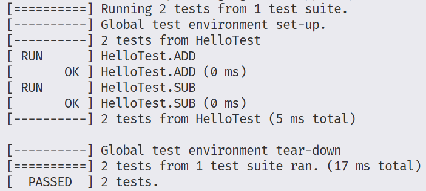

# GoogleTest-Cpp-CMake-Template
This is a GoogleTest CMake template for C++ project, I use it in my windows platform.

# How to use it

1. Add your test source files in the `function` folder, example:

+ `function/TestFunction.h`

```cpp
#ifndef TEST_FUNCTION_H
#define TEST_FUNCTION_H

int add(int a_, int b_);
int sub(int a_, int b_);

#endif // TEST_FUNCTION_H
```
+ `function/TestFunction.cpp`

```cpp
#include "TestFunction.h"

int add(int a_, int b_)
{
    return a_ + b_;
}

int sub(int a_, int b_)
{
    return a_ - b_;
}
```

2. Add your test code in the `test/gcheck.cpp`, like this:

```cpp
#include <gtest/gtest.h>

// add your test function header file
#include "function/TestFunction.h"

TEST(HelloTest, ADD)
{
    EXPECT_EQ(5, add(2, 3));
}

TEST(HelloTest, SUB)
{

    EXPECT_EQ(2, sub(5, 3));
}
```

3. Set up your terminal and type `.\run.bat` to run the test. here I use the `MinGW7.3.0` to compile the test project (you can choose other compilers that you use), the `run.bat` file I use is:

```bat
cmake -S . -B build -G "MinGW Makefiles"
cmake --build build 
.\build\test\Test.exe
```

4. Finally, you will see the test result:



